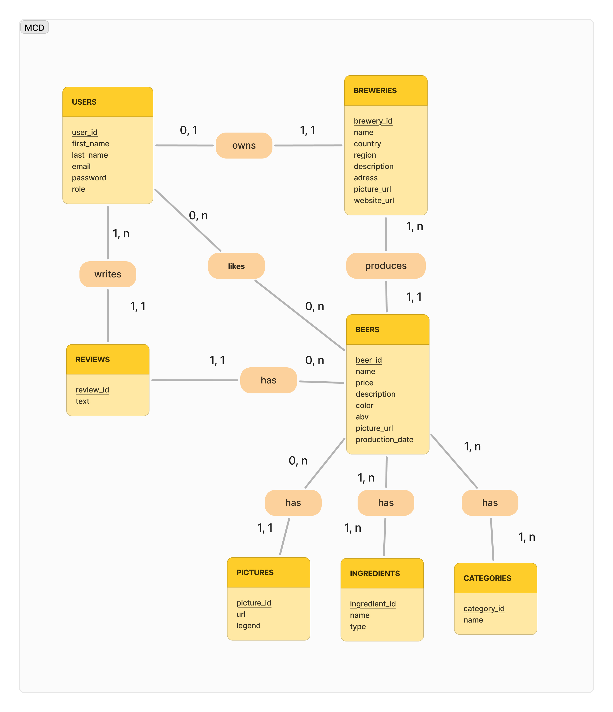
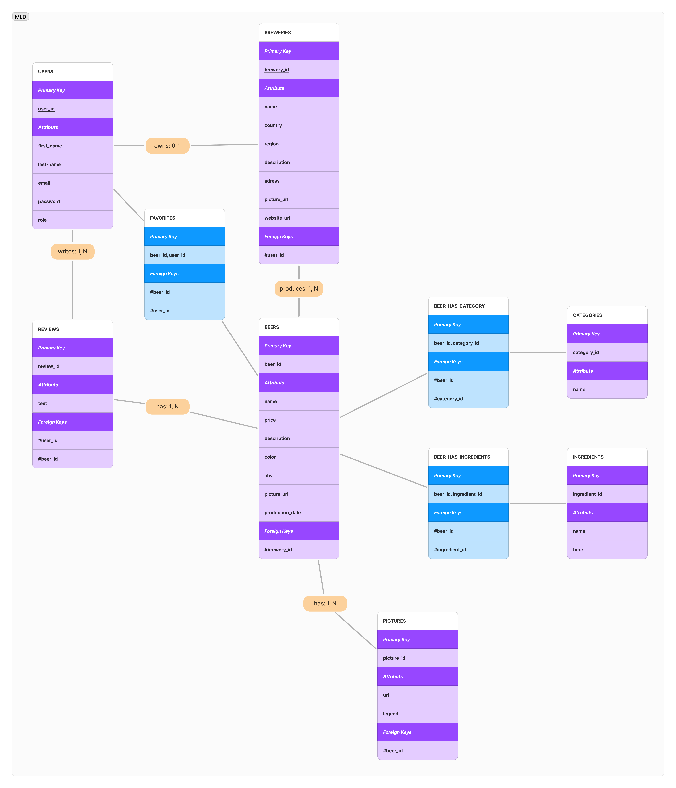
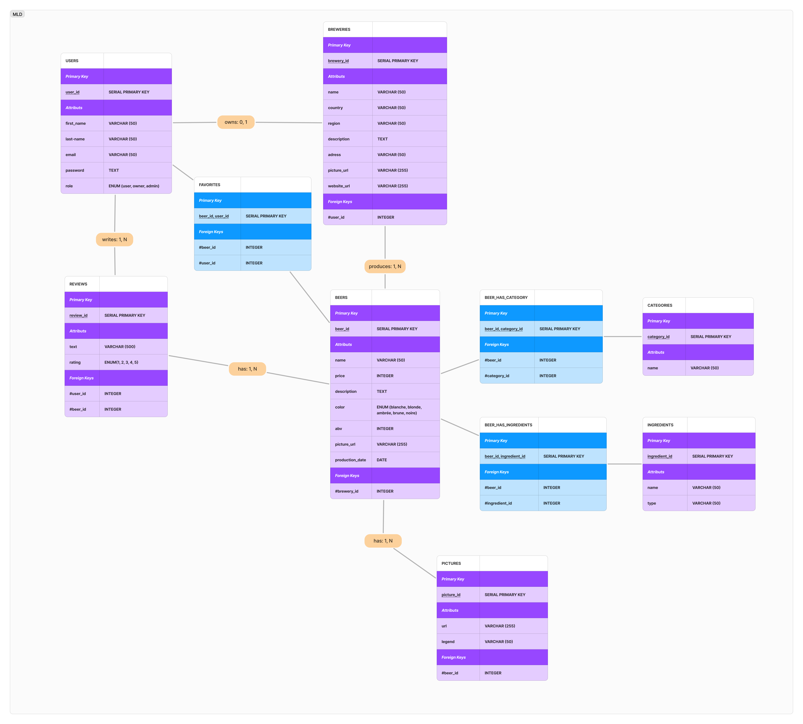

# Zythologue - La Base de données des amateurs de bières 🍺

Ce projet configure une base de données PostgrerSQL de "zythologue" (amateur et connaisseur de bière) avec Docker et un Docker Compose. La base de données permet de référencer les brasseries, leurs bières, et permet aux utilisateurs de donner leurs avis avec des notes pour les bières qu'ils préfèrent (ou non).


## Pré-requis

Pour installer ce projet en local vous aurez besoin de :

`DOCKER` 🐳


## Lancer localement

Clonez le projet :

```bash
  git clone https://github.com/2024-devops-alt-dist/zytho-YC.git
```

Allez dans le dossier :

```bash
  cd zytho-yc
```

Lancez le container Docker grâce au docker-compose.yml qui se trouve dans le dossier :

```bash
  docker-compose up -d
```

## Lancement des Scripts automatiques

### Docker-Compose

 Dans le docker-compose on retrouve :
- L'image (et sa version) importée depuis docker-hub : `postgres:15-alpine`
- Le nom du container (que vous choisissez vous même) : `new-postgres-container`
- Les variables d'environment (à modifier selon votre user/password) : `POSTGRES_USER` `POSTGRES_PASSWORD`
- Le port utilisé par le docker pour postgres : `ports : "5432:5432"`
- Le volume utilisé pour persister les données : `postgresdata:`
- Et où est stocké ce volume (le chemin dans le container) : `/var/lib/postgresql/data` 
- Un fichier d'initialisation qui se lance au montage du container : `./db-scripts:`
- Et où est envoyé ce fichier dans le container : `/docker-entrypoint-initdb.d/  `


```yaml
services:
  postgres:
    image: postgres:15-alpine 
    container_name: new-postgres-container
    restart: always
    environment:
      POSTGRES_USER: myuser
      POSTGRES_PASSWORD: mypassword
      POSTGRES_DB: zythologue
    ports:
      - "5432:5432"
    volumes:
      - postgresdata:/var/lib/postgresql/data
      - ./db-scripts:/docker-entrypoint-initdb.d/   

volumes:
  postgresdata:
```

### db-scripts

Les scripts stockés dans le dossier `db-scripts` vont se lancer automatiquement au montage du container. Ils sont nommés : `01-Create_tables.sql` `02-Insert_data.sql` de façon à les lancer l'un après l'autre. 

Comme nous avons créé un volume relié à notre container, ces données seront persistée même si l'on stoppe le container. Cependant, grâce à ce script, même en supprimant le volume lié au container les données seront renvoyés si nous remontont le container avec `docker-compose.yml`.
## Tables

Les tables créées dans la base de données sont :

- users
- breweries
- beers
- reviews
- pictures
- categories
- ingredients
- favorites
- beer_has_category
- beer_has_ingredients


## Modèles Merise

- MCD (→ merise-model/01-MCD.jpg)



- MLD (→ merise-model/02-MLD.jpg)



- MCD (→ merise-model/03-MPD.jpg)



- Dictionnaire de données : [ici](https://docs.google.com/spreadsheets/d/1xLywJeP185rk2oobuQUTrANUFJQ5vGgVFMFrtXhDjcc/edit?usp=sharing)
